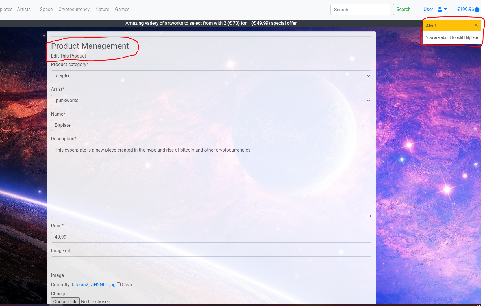
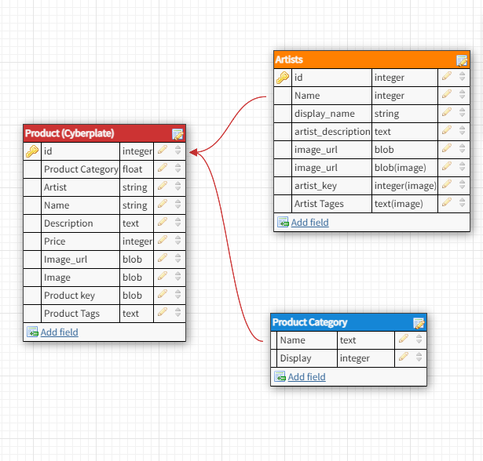

# Cyberplate

# Forth Milestone Project 

## Table of Contents
1. UX
2. Features
3. Technologies Used
4. Testing 
5. Deployment
6. Credits and Acknowledgements

# UX

#### User Stories

- As an external user I want the following:

    - To be able to navigate the website easily to find the graphic designs Im interest in.

    - To be able to make searches that will generally search the products Im looking for.

    - To be able to then purchase a design once I find the one Im looking for.

    - To be able to easily update/delete items in my shopping bag before making a payment

    - To be able to see previous orders that I made as a user

- As an Internal user I want the following:

    - To have a visually apealling website that draws users in once they land on the homepage.

    - To have a website that is easy to navigate.

    - To have a website that allows users to easily place an order which I can recieve payments from.

    - To be able to see the orders made by external users ordering from the website.

    - To be able to add/edit/delete and update products on the website.

#### Wireframes

The five planes Strategy, Scope, Structure, Skeleton and Surface of UX were kept in mind from the beginning of the design to the end. Starting with an abstract concept of giving external users an effortless way to purchase stunning artwork from internal users looking for an effective way to deliver this, the end result was this Cyberplate website.

The wireframes for this project were a very basic starting place for me to lay the foundation of the website. Other screens were added such as login/sign-up/confirm email/ but these views come with the Django framework and are such a standard part of a website that I didnt include them in the wireframes. Some other screens that did not come with the framework and that were not created at the beginning in the wireframes were the checkout view, product, artist view and custom 404 page.

#### Design
The overall theme of the website is a visually captivating one. When the user first lands on the site there is a very obvious navigation menu with profile information in the top right. From the homepage there is a very clear direction for the user. Either they can go straight to "SHOP NOW" or if they do not have an account they can first "Sign Up" or login.

Once the user is in they are directed to the products page and from here they are very easily able to search for certain keywords, browse the products by collection or artist. Once they land one a artist they or product they will be able to see related work to the artist/product which gives for a better user experience.

On viewing a single product the user with be able to see the name, artist, description and the related work to that product is placed under that piece. A primary button in the center will be highlighted to the user to prompt them to add it to their bag. The related products underneath viewing a single product will when hovered over with a mouse display the name and description to the user of that related product. They will then be directed to that products view if they click on it.

On the Artist page users will see four main artists. When a user clicks on an artist they will be directed to their page and a list of that artists creations will be underneath the artists description. These creations will expand to be viewed when clicked upon. Then when a user clicks on the image of that creation they will be directed to that product view where they can add it to their bag.

When a user is satisfied with their selection they may navigate to view thier bag before checkout either from the products view page or from the top right hand corner in the navigation bar. When viewing their bag items they will be able to edit or delete these items before proceeding to the final checkout page.

On the checkout page users will enter their billing and card details. Here the form will ensure valid form data and Stripe will ensure valid card details. Once complete the user will be taken to an order summery page where they may view the details of this order.

Users have a profile page from which they can update their personal information and view previous orders.

Finally throughout the site boostrap toast messages will appear when certain actions are taken such as adding products to the bag, updating information or with errors that occur to allow the user to know when certain actions have benn taken.

#### Styling
For the styling of this site Roboto font was used throughout as it have the correct feel for this graphic design site. Font Awesome Icons were used throughout as they gave a familiar website user expeience.

#### Images
All the images and graphic pieces for this website were chosen because they were so visually appealing which is what is likely to draw users in and hold their attention when they land on it. Logos for the artists were created online at Tailor Brands and were made with a modern experince in mind.

# Features
There are many features incorporated in this website taken from what I have learnt previously and in this module. They include:

- A navigation menu that collapses on mobile with a searchbar.
- A responsive website across all devices.
- Carousel of images on the homepage that rotate.
- Javascript that allows for increasing/decreasing a products quantity before adding to the bag.
- JQueary that provides a hover effect over related products, displaying the name and description.
- JQueary that provides an accordion effect for products on the Artists page expanding and collapsing them.
- JQueary that provides an update/delete option on the users bag.
- Boostrap toasts give feedback to the user on certain actions or errors made.
- Stripe allows for secure transactions to be made along with their webhooks which ensure orders are created successfully.
- A profile page gives users the ability to see their previos orders and their information.
- Confirmation emails are sent to users for registration and orders.

# Technologies Used

- HTML5 for the website strcuture.

- Bootstrap/CSS3 for the websites appearence.

- Font awesome

- Javascript/JQuery

- Stripe for payments

- Django/Python3 for the backend

- AWS to store static files 

- Django as a web framework

- Heroku as a backend and Github as a repository

# Testing 

## User Stories:

### Internal User

1 To be able to navigate the website easily to find the graphic designs Im interest in:

    - From the homepage a user has a navbar to take the across the website.
    - They are presented with a "SHOP NOW" button which will take them to all the products.

2 To be able to make searches that will generally search the products Im looking for:

 - Users have a searchbar to allow them to make searches on available products.
 - Users have collections which they can click to get a certain theme.
 - Users have artists which they can click to get that artists work. Expanding and collapsing their work upon clicking.

3 To be able to then purchase a design once I find the one Im looking for:

   - Users have a payment form which will submit using Stripe to handle payments.
   - Users will be notified if their card is decline/or payment not made.
   - Users will then be directed to a payment success page showing their otrder details.

4 To be able to easily update/delete items in my shopping bag before making a payment:

    - Users will be able to update/delete items before checkout.

5 To be able to see previous orders that I made as a user:

    - Users must first login or register before they can see previous order information.
    - Once logged in they have a profile page with biling details and previous orders.
    - Upon clicking an order ID the user will see the details of that particular order.

If a user should enter a url that is not in the website they will be directed to a custom 404 page and directed back

### External User

1 To have a visually apealling website that draws users in once they land on the homepage:

    - This website it visually captivating, with a very rich background image and product images used to provide a positive user experience.
    - The hompage maximizes on the visuals by keeping product content on the left so that the planet on the right isnt covered up.
    - A carousel underneath rotates through similar products to make use of the space and peak an external users interest further.

2 To have a website that is easy to navigate:

    - This website gives a user the ability to search by text, by Artist or by collection all in the narbar.
    - When users are on a certain product they will be shown similar products underneath which are clickable and direct the user, this provides easy navigation.
    - When users are on a certain artist they will be able to see the works by this artist which expand and are clickable, this provides easy navigation.

3 To have a website that allows users to easily place an order which I can recieve payments from:

    - External users can place orders through the Stripe elements on the payments form. 

4 To be able to see the orders made by external users ordering from the website:

    - Internal users will be able to see the orders coming in from users by Stripe and its webhooks which will ensure orders are created.

5 To be able to add/edit/delete and update products on the website:

    - Only site owners have the ability to add/edit/delete and update products from sign in.
    - Delete/Edit buttons will show for the superuser and an Add option in the top right and corner under user
 

## Devices Tested:

 - 24 inche dell monitor
 - 16 inche lenovo laptop
 - Galaxy S5
 - Pixel 2
 - iPhone 6/7 & 8
 - iPhone X
 - iPad
 - Galaxy Fold

## Known Bugs, Issues and fixes:

- Currently adding products does allow to go negative but will not submit so it isnt seen as a critical issue 

- Currently the bag view shows a slight amount of space to the right on a medium device. As this has greatly been improved upon already and isnt critical it is something to be improved on in the future.

- There is a brief moment when going from a large to small device that the nav-bar displays slightly off design. As this is non critical and only appears for a span of about 200 pixals it will be improved upon in future.

The total amount originally wasn't rendering through, however this is now fixed and is displaying correctly. The wrong field was being used in the model and has been solved with the below code 

        self.order_total = self.lineitems.aggregate(Sum(
        'lineitem_total'))['lineitem_total__sum'] or 0
        self.grand_total = self.order_total
        self.save()

        instance.order_item.update_total()

- I have noticed that on the live deployment sometimes AWS will undo the permissions that I have granted for access to all, I am not sure as to why this is. As of writing this README permission are granted and screenshots provided below

## Data Schema

For this project I created my own data, everything was added manually and the credits for the product images are referenced below in the credits. The database is in Heroku Postgres. The relationships between the data stored here can be seen in the schema below which was created using dbdesigner which is credited below

## Validators

The Validation for the HTML was done by viewing the page source.

- [HTML home](media/HTML_home.PNG)
- [HTML products](media/HTML_Products.PNG)
- [HTML products view](media/HTML_Products_view.PNG)
- [HTML artist](media/HTML_Artists.PNG)
- [HTML artist view](media/HTML_Artists_view.PNG)
- [HTML checkout](media/HTML_Checkout.PNG)
- [HTML order history](media/HTML_order_history.PNG)
- [HTML profile](media/HTML_Profile.PNG)

The Validation for the Javascript/JQuery was done by pasting the code into https://jshint.com/

- [JS Stripe](media/JSVal_Stripe.PNG)
- [JS Product/Artist/Quantity](media/JSVal_Product_Artist_Quantity.PNG)

The Validation for the CSS was done by pasting the code into https://jigsaw.w3.org/css-validator/

- [CSS base](media/css_val.PNG)
- [CSS checkout](media/val_checkout.PNG)

The Validation for the python was done on http://pep8online.com/

# Deployment

To deploy this project Heroku is needed for the backend, a IDE (In my case gitpod) Github was used as a repository and AWS used to host the static files and Stripe to delivery a secure payments. Accounts will be needed on these before starting. It is important to note that this project wont run locally unless the enviroment variables are set up correctly within the enviroment. These variables and values must be the same within the Heroku deployment tab.

## Deploying On Heroku

- Go to Heroku.com and set up an account
- Create an app with a unique name
- Select a region
- Go to the "Resources" tab 
- Select Postgres

To ensure Heroku installs all the apps requirements on deployment In the IDE enter:
- pip3 install dj_database_url
- pip3 install psycopg2-binary
- pip3 freeze > requirements.txt

Take the Database config variable from Heroku in the Settings tab 
- Place it in the Settings file in the IDE to be used as a database such as below:
    - 
- Import dj_database_url in the Settings file

Because we are now connecting to Heroku, migrations need to be run so in the IDE enter:

- python3 manage.py showmigrations
- python3 manage.py migrate 

To load the data first the Artist and Category data must be loaded before loading the Products. To do this in the IDE enter:

- python3 manage.py load data Artists
- python3 manage.py load data Category
- python3 manage.py load data Product

Create a Superuser account to login with by:

- python3 manage.py create superuser and then enter the user details

To get a webserver install gunicorn by entering:

- pip3 install gunicorn
- pip3 freeze > requirements.txt

Next create a Procfile and enter into that file:
- "web: gunicorn APP-NAME-GOES-HERE.wsgi:application"

As AWS will be used for hosting the static files, we need to omnit them from Heroku. To do this login into Heroku from the IDE by using:
- heroku login -i
- Heroku config:set DISABLE_COLLECTSTATIC=1 –-app APP-NAME-GOES-HERE
- In the Settings file ALLOWED_HOSTS will need to be altered to ['APP-NAME-GOES-HERE.herokuapp.com', 'localhost']

Now deploy to Heroku by:
- git add .
- git commit -m "Deploying to Heroku"
- heroku git:remote -a APP-NAME-GOES-HERE
- git push heroku master

To ensure that the workspace deployments flow through automatically to Heroku
- Go to Heroku.com
- Go to the "Deploy" tab
- Go to the "Deployment method"
- Search for the repository name, connect and "Enable Automatic Deployments"

Replace the "SECRET_KEY" variable that is in the Settings file with a new one saved to Heroku
- Generate a new key
- Go to the config vars on the "Settings" tab on Heroku
- Add in the newly generated key 
- Then back in the Settings file replace the "SECRET_KEY" with a call to get it from the enviroment like below:
    - 

Push these changes to github by:
- git add .
- git commit -m "Deploying"
- git push

## Deploying On AWS

- Go to https://aws.amazon.com/
- Create an account to use the s3 service for our static files
- Add in the needed details and select the closest region
- AWS will require card details 
- Once the account is created go to the AWS Management Console and select the s3 service
- Create a new "Bucket"
- Unblock all public access, click acknowledge and click "Create"

Within the "Bucket"
- Go to the "Properties" tab and select "Static web hosting"
- Fill in default values for the index and error selections
- Click save

Go to the "Permissions" tab
- For the "Cors configuration" add in the below to allow access between this "Bucket" and the Heroku deployment from above

        [
            {
                "AllowedHeaders": [
                    "Authorization"
                ],
                "AllowedMethods": [
                    "GET"
                ],
                "AllowedOrigins": [
                    "*"
                ],
                "ExposeHeaders": []
            } 
        ]

Go to the "Policy" tab and select the policy generator
- Policy type is s3 Bucket Policy
- Allow all principles by *
- Actions are "get object" 
- Copy in the ARN
- Click "Add Statment", then "Generate Policy" 
- Copy this policy into the "Buck Policy Editor" 
- Include a /* at the and of the ARN so that the policy looks like this

        {
            "Version": "2012-10-17",
            "Id": "Policy1638960375040",
            "Statement": [
                {
                    "Sid": "Stmt1638960369369",
                    "Effect": "Allow",
                    "Principal": "*",
                    "Action": "s3:*",
                    "Resource": "arn:aws:s3:::cyberplate-ms4/*"
                }
            ]
        }

- In the "Access control list" ensure that everyone has access which looks like the below :
 

A user must now be created to access this "Bucket"
 - Go to IAM
 - Click "Groups" and create a new group
 - Click "Policies", go to the json tab and import managed policy by selecting "AmazonS3FullAccess"
 - Add the ARN into the policy
 - Click review policy, give the policy a name and description and click create

Now attach the policy to the group that was created
 - Go to Groups
 - Click the group that was created
 - Click "attach policy"
 - Find the policy that was created

Now a user must be created and placed within the group
- Click "Users"
- Click "Add user" 
- Create a user
- Allow programmatic access
- Place the user into the group 
- Download the csv file at the end which contains the users access which will be used to authenticate them

Django must now be connected to s3, in order to do this go back over to the IDE(Gitpod) and use the commands:

- pip3 install boto3
- pip3 install django-storages
- pip3 freeze > requirements.txt

Then in the Settings file add:
- "storages" to the Django installed apps

- Then at the end of the Settings file add the below code:

    if 'USE_AWS' in os.environ:
        # Cache control
        AWS_S3_OBJECT_PARAMETERS = {
            'Expires': 'Thu, 31 Dec 2099 20:00:00 GMT',
            'CacheControl': 'max-age=94608000',
        }
        AWS_STORAGE_BUCKET_NAME = 'cyberplate-ms4'
        AWS_S3_REGION_NAME = 'eu-west-1'
        AWS_ACCESS_KEY_ID = os.environ.get('AWS_ACCESS_KEY_ID')
        AWS_SECRET_ACCESS_KEY = os.environ.get('AWS_SECRET_ACCESS_KEY')
        AWS_S3_CUSTOM_DOMAIN = f'{AWS_STORAGE_BUCKET_NAME}.s3.amazonaws.com'

Then over in Heroku add these new AWS keys to the config variables in the "Settings" tab
    - Add the two new keys into the config variables
    - Add another key into the config variables and set its value equal to "True"
    - Remove the disable collectstatic variable

Back in IDE (gitpod) create a new file called "custom_storages.py" and add the below into that file:

        from django.conf import settings
        from storages.backends.s3boto3 import S3Boto3Storage

        class StaticStorage(S3Boto3Storage):
        location = settings.STATICFILES_LOCATION

        class MediaStorage(S3Boto3Storage):
        location = settings.MEDIAFILES_LOCATION

Back in the settings file add the below code to our if 'USE_AWS' in os.environ statement:

        # Static and media files
        STATICFILES_STORAGE = 'custom_storages.StaticStorage'
        STATICFILES_LOCATION = 'static'
        DEFAULT_FILE_STORAGE = 'custom_storages.MediaStorage'
        MEDIAFILES_LOCATION = 'media'

        # Override static and media URLs in production
        STATIC_URL = f'https://{AWS_S3_CUSTOM_DOMAIN}/{STATICFILES_LOCATION}/'
        MEDIA_URL = f'https://{AWS_S3_CUSTOM_DOMAIN}/{MEDIAFILES_LOCATION}/'

So that now the full statment should look like:

 

Finlly when all that is done we can now push this in the IDE (gitpod) which will automatically flow through to Heroku:
    - git add .
    - git commit -m "deployment" 
    - git push

To add the media files, simply go over to s3 in AWS, within the media folder add the files and upload ensuring "public read" is selected

## Cloning and Forking

How to clone and deploy this project:
 - Navigate to the repository where the project is stored.
 - Click on the Code button which will give the option to download the content and the url.
 - Copy the url.
 - In your chosen IDE in the terminal type "git clone (followed by the copied url)".

How to Fork this project:
 - Log onto github and at the top of this repository there is an option "Fork"
 - This will give you a copy of the repository

credits:

 Images Used:
- https://www.maxpixel.net/Planet-Fantasy-Wallpaper-Galaxy-Bus-Space-Eclipse-4838313
- https://wallpaperaccess.com/gaming
- https://www.maxpixel.net/Landscape-Nature-Wallpaper-For-Girls-Tree-4032192
- https://wallpaperaccess.com/1600x900-space
- https://www.piplum.com/news/crypto-quotes/
- https://pixabay.com/photos/nature-waters-lake-island-3082832/
- https://www.teahub.io/viewwp/hioRw_game-wallpaper-hd-fallout-3/
- https://www.pdvg.it/wp-content/uploads/2019/03/image.jpg
- https://wallpaperaccess.com/hd-nature
- https://wall.alphacoders.com/big.php?i=1135135
- https://wallpapersafari.com/halo-wallpaper-hd-4k/
- https://hdqwalls.com/bitcoin-cryptocurrency5k-wallpaper

Rescources that provided me with help:
- https://www.w3schools.com/bootstrap4/bootstrap_flex.asp
- https://stackoverflow.com/questions/43544366/anonymoususer-object-is-not-iterable-django
- https://stackoverflow.com/questions/833032/submit-is-not-a-function-error-in-javascript
- https://api.jqueryui.com/toggleclass/
- https://stackoverflow.com/questions/12003736/django-login-required-decorator-for-a-superuser
- https://docs.djangoproject.com/en/dev/ref/templates/builtins/#built-in-filter-reference
- https://stackoverflow.com/questions/43544366/anonymoususer-object-is-not-iterable-django
- https://www.w3schools.com/bootstrap4/bootstrap_carousel.asp
- https://stackoverflow.com/questions/833032/submit-is-not-a-function-error-in-javascript
- https://app.dbdesigner.net/

Acknowledgements:
The inspiration for this project came from the website Displate https://displate.com/ 
