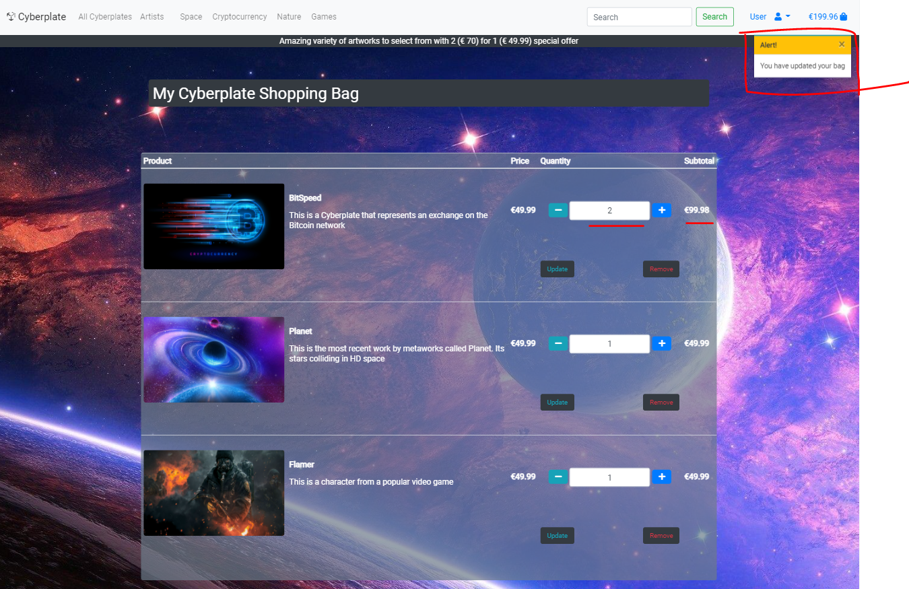
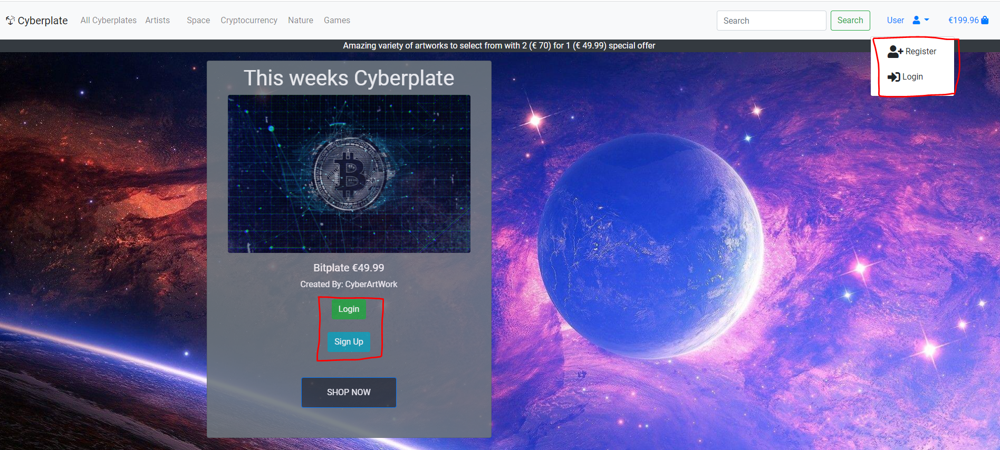

# Cyberplate

# Forth Milestone Project 

## Table of Contents
1. UX
2. Features
3. Technologies Used
4. Testing 
5. Deployment
6. Credits and Acknowledgements

# UX

#### User Stories

- As an external user I want the following:

    - To be able to navigate the website easily to find the graphic designs Im interest in.

    - To be able to make searches that will generally search the products Im looking for.

    - To be able to then purchase a design once I find the one Im looking for.

    - To be able to easily update/delete items in my shopping bag before making a payment

    - To be able to see previous orders that I made as a user

- As an Internal user I want the following:

    - To have a visually apealling website that draws users in once they land on the homepage.

    - To have a website that is easy to navigate.

    - To have a website that allows users to easily place an order which I can recieve payments from.

    - To be able to see the orders made by external users ordering from the website.

    - To be able to add/edit/delete and update products on the website.

#### Wireframes

The five planes Strategy, Scope, Structure, Skeleton and Surface of UX were kept in mind from the beginning of the design to the end. Starting with an abstract concept of giving external users an effortless way to purchase stunning artwork from internal users looking for an effective way to deliver this, the end result was this Cyberplate website.

The wireframes for this project were a very basic starting place for me to lay the foundation of the website. Other screens were added such as login/sign-up/confirm email/ but these views come with the Django framework and are such a standard part of a website that I didnt include them in the wireframes. Some other screens that did not come with the framework and that were not created at the beginning in the wireframes were the checkout view, product, artist view and custom 404 page.

#### Design
The overall theme of the website is a visually captivating one. When the user first lands on the site there is a very obvious navigation menu with profile information in the top right. From the homepage there is a very clear direction for the user. Either they can go straight to "SHOP NOW" or if they do not have an account they can first "Sign Up" or login.

Once the user is in they are directed to the products page and from here they are very easily able to search for certain keywords, browse the products by collection or artist. Once they land one a artist they or product they will be able to see related work to the artist/product which gives for a better user experience.

On viewing a single product the user with be able to see the name, artist, description and the related work to that product is placed under that piece. A primary button in the center will be highlighted to the user to prompt them to add it to their bag. The related products underneath viewing a single product will when hovered over with a mouse display the name and description to the user of that related product. They will then be directed to that products view if they click on it.

On the Artist page users will see four main artists. When a user clicks on an artist they will be directed to their page and a list of that artists creations will be underneath the artists description. These creations will expand to be viewed when clicked upon. Then when a user clicks on the image of that creation they will be directed to that product view where they can add it to their bag.

When a user is satisfied with their selection they may navigate to view thier bag before checkout either from the products view page or from the top right hand corner in the navigation bar. When viewing their bag items they will be able to edit or delete these items before proceeding to the final checkout page.

On the checkout page users will enter their billing and card details. Here the form will ensure valid form data and Stripe will ensure valid card details. Once complete the user will be taken to an order summery page where they may view the details of this order.

Users have a profile page from which they can update their personal information and view previous orders.

Finally throughout the site boostrap toast messages will appear when certain actions are taken such as adding products to the bag, updating information or with errors that occur to allow the user to know when certain actions have benn taken.

#### Styling
For the styling of this site Roboto font was used throughout as it have the correct feel for this graphic design site. Font Awesome Icons were used throughout as they gave a familiar website user expeience.

#### Images
All the images and graphic pieces for this website were chosen because they were so visually appealing which is what is likely to draw users in and hold their attention when they land on it. Logos for the artists were created online at Tailor Brands and were made with a modern experince in mind.

# Features
There are many features incorporated in this website taken from what I have learnt previously and in this module. They include:

- A navigation menu that collapses on mobile with a searchbar.
- A responsive website across all devices.
- Carousel of images on the homepage that rotate.
- Javascript that allows for increasing/decreasing a products quantity before adding to the bag.
- JQueary that provides a hover effect over related products, displaying the name and description.
- JQueary that provides an accordion effect for products on the Artists page expanding and collapsing them.
- JQueary that provides an update/delete option on the users bag.
- Boostrap toasts give feedback to the user on certain actions or errors made.
- Stripe allows for secure transactions to be made along with their webhooks which ensure orders are created successfully.
- A profile page gives users the ability to see their previos orders and their information.
- Confirmation emails are sent to users for registration and orders.

# Technologies Used

- HTML5 for the website strcuture.

- Bootstrap/CSS3 for the websites appearence.

- Font awesome

- Javascript/JQuery

- Stripe for payments

- Django/Python3 for the backend

- AWS to store static files 

- Django as a web framework

- Heroku as a backend and Github as a repository

# Testing 

## User Stories:

### Internal User

1 To be able to navigate the website easily to find the graphic designs Im interest in:

    - From the homepage a user has a navbar to take the across the website.
    - They are presented with a "SHOP NOW" button which will take them to all the products.

2 To be able to make searches that will generally search the products Im looking for:

 - Users have a searchbar to allow them to make searches on available products.
 - Users have collections which they can click to get a certain theme.
 - Users have artists which they can click to get that artists work. Expanding and collapsing their work upon clicking.

3 To be able to then purchase a design once I find the one Im looking for:

   - Users have a payment form which will submit using Stripe to handle payments.
   - Users will then be directed to a payment success page showing their otrder details.

4 To be able to easily update/delete items in my shopping bag before making a payment:

    - Users will be able to update/delete items before checkout.

5 To be able to see previous orders that I made as a user:

    - Users must first login or register before they can see previous order information.
    - Once logged in they have a profile page with biling details and previous orders.
    - Upon clicking an order ID the user will see the details of that particular order.

### External User

1 To have a visually apealling website that draws users in once they land on the homepage:

    - This website it visually captivating, with a very rich background image and product images used to provide a positive user experience.
    - The hompage maximizes on the visuals by keeping product content on the left so that the planet on the right isnt covered up.
    - A carousel underneath rotates through similar products to make use of the space and peak an external users interest further.

2 To have a website that is easy to navigate:

    - This website gives a user the ability to search by text, by Artist or by collection all in the narbar.
    - When users are on a certain product they will be shown similar products underneath which are clickable and direct the user, this provides easy navigation.
    - When users are on a certain artist they will be able to see the works by this artist which expand and are clickable, this provides easy navigation.

3 To have a website that allows users to easily place an order which I can recieve payments from:

    - External users can place orders through the Stripe elements on the payments form. 

4 To be able to see the orders made by external users ordering from the website:

    - Internal users will be able to see the orders coming in from users by Stripe and its webhooks which will ensure orders are created.

5 To be able to add/edit/delete and update products on the website:

    - Only site owners have the ability to add/edit/delete and update products from sign in.

credts:

 Images Used:
- https://www.maxpixel.net/Planet-Fantasy-Wallpaper-Galaxy-Bus-Space-Eclipse-4838313
- https://wallpaperaccess.com/gaming
- https://www.maxpixel.net/Landscape-Nature-Wallpaper-For-Girls-Tree-4032192
- https://wallpaperaccess.com/1600x900-space
- https://www.piplum.com/news/crypto-quotes/
- https://pixabay.com/photos/nature-waters-lake-island-3082832/
- https://www.teahub.io/viewwp/hioRw_game-wallpaper-hd-fallout-3/
- https://www.pdvg.it/wp-content/uploads/2019/03/image.jpg
- https://wallpaperaccess.com/hd-nature
- https://wall.alphacoders.com/big.php?i=1135135

Rescources that provided me with help:
- https://www.w3schools.com/bootstrap4/bootstrap_flex.asp
- https://stackoverflow.com/questions/43544366/anonymoususer-object-is-not-iterable-django
- https://stackoverflow.com/questions/833032/submit-is-not-a-function-error-in-javascript
- https://api.jqueryui.com/toggleclass/
- https://stackoverflow.com/questions/12003736/django-login-required-decorator-for-a-superuser
- https://docs.djangoproject.com/en/dev/ref/templates/builtins/#built-in-filter-reference
- https://stackoverflow.com/questions/43544366/anonymoususer-object-is-not-iterable-django
- https://www.w3schools.com/bootstrap4/bootstrap_carousel.asp
- https://stackoverflow.com/questions/833032/submit-is-not-a-function-error-in-javascript

Acknowledgements:
The inspiration for this project came from the website Displate https://displate.com/ 
